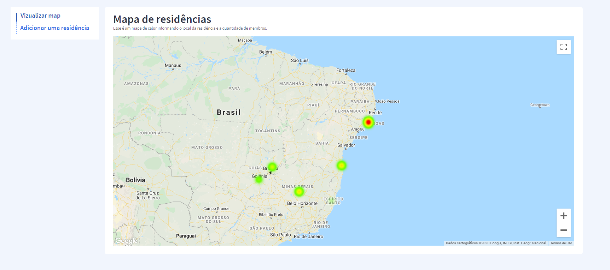
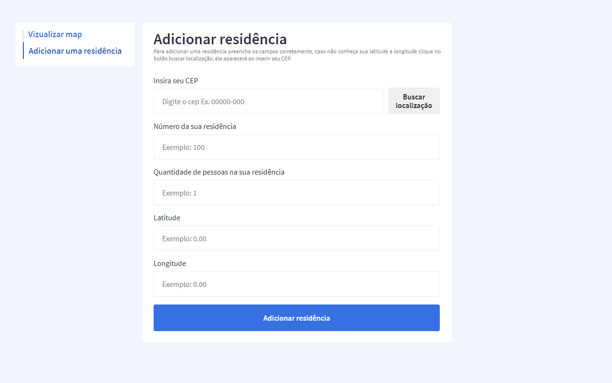
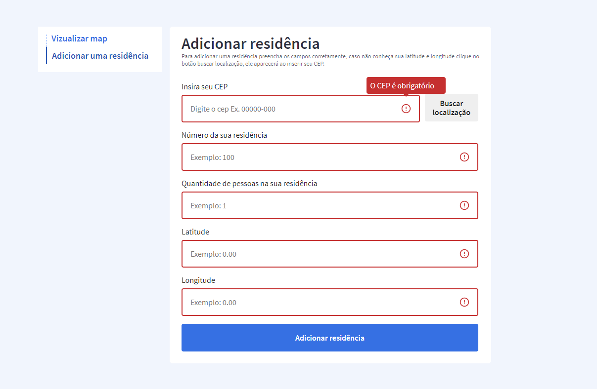

<h4 align="center">
	💻 Desáfio - Suntech
</h4>

<p align="center">
 <a href="#-sobre-o-projeto">Sobre</a> •
 <a href="#user-content-️-funcionalidades">Funcionalidades</a> •
 <a href="#-layout">Layout</a> •
 <a href="#-como-executar-o-projeto">Como executar</a> •
 <a href="#-tecnologias">Tecnologias</a> •
 <a href="#-autor">Autore</a> •
 <a href="#user-content--licença">Licença</a> •

</p>

## 💻 Sobre o projeto

Esse projeto faz parte de um processo seletivo da empresa Suntech, que consiste na criação do cadastro de residências com 5 atributos: CEP, número, latitude, longitude, quantidade de residentes e validação dos campos no formulário. Com esses dados criar um mapa de calor levando em consideração a quantidade de residentes.

## ⚙️ Funcionalidades

- [x] Cadastro de residências
- [x] Mapa de calor

---

## 🎨 Layout

O layout da aplicação.

### Frontend

<p align="center">
  

  

   
</p>

---

## 🚀 Como executar o projeto

### Pré-requisitos

Antes de começar, você vai precisar ter instalado em sua máquina as seguintes ferramentas:
[Git](https://git-scm.com), [Node.js](https://nodejs.org/en/).
Além disto é bom ter um editor para trabalhar com o código como [VSCode](https://code.visualstudio.com/)

#### 🧭 Rodando a aplicação

```bash

# Clone este repositório
$ git clone git@github.com:geanfeltrin/Challenge-Suntech

# Acesse a pasta do projeto no seu terminal/cmd
$ cd Challenge-Suntech

# Inicialmente acesse a pasta backend
$ cd backend

#Instale o json-server
$ npm install -g json-server

# Inicie o json-server
$ yarn start or npm run start

# Acesse a pasta web para iniciar o frontend
$ cd web

# Crie um arquivo .env na raiz do projeto igual ao .env.exemple para informar sua key do google map
$ touch .env

# Instale as dependências
$ yarn install

# Execute a aplicação em modo de desenvolvimento
$ yarn start

# A aplicação será aberta na porta:3001 - acesse http://localhost:3001 por que o json-server executa na porta 3000

```

---

## 🛠 Tecnologias

As seguintes ferramentas foram usadas na construção do projeto:

#### **Frontend** ([ReactJs])(https://reactjs.org/)

- **[ReactJs](https://reactjs.org/)**
- **[Typescript](https://www.typescriptlang.org/)**
- **[Axios](https://github.com/axios/axios)**
- **[Styled-Components](https://styled-components.com/)**
- **[Google-Map-React](https://github.com/google-map-react/google-map-react)**

#### **Backend** ([json-server])(https://github.com/typicode/json-server)

## 🦸 Autor

<a href="https://github.com/geanfeltrin">
 
 <br />
  <sub>
    <b>Gean Feltrin - Web Developer</b>
  </sub>
</a>
 <br />

[](https://twitter.com/Geanfeltrin1) [](https://www.linkedin.com/in/geanfeltrin/)
[](mailto:geanfeltrin75@gmail.com)

---

## 📝 Licença

Este projeto esta sobe a licença [MIT](./LICENSE).

Feito com ❤️ por Gean Feltrin 👋🏽 [Entre em contato!](https://www.linkedin.com/in/geanfeltrin/)

---
